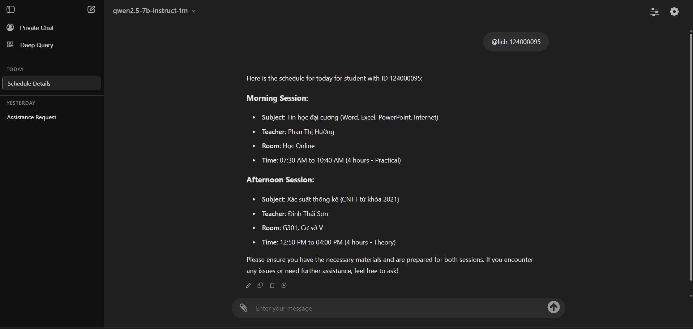
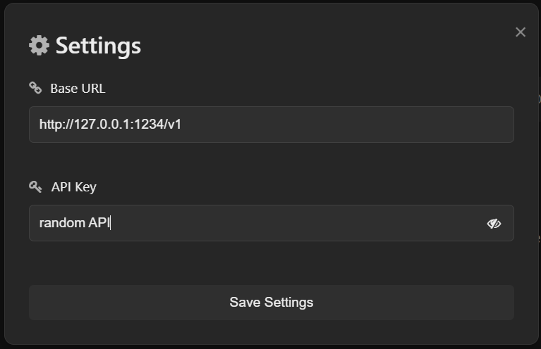

<div align="center">
  <h1>💫 Chat UI 🤖</h1>
  
  <p>
    
    
    
    
    
  </p>

  <strong>Fully Offline Chat User Interface for Large Language Models</strong>
  
  
  
  <p><i>This is a fork of the original project: <a href="https://github.com/Toy-97/Chat-WebUI">https://github.com/Toy-97/Chat-WebUI</a></i></p>
</div>

## Overview
Chat WebUI is an open-source, locally hosted web application that puts the power of conversational AI at your fingertips with an intuitive interface for text, document, and vision models.

This fork focus on adding [tools](#smart-tools) to improve LLMs functionality, especially for small and local LLMs.

## Key Features
- **ChatGPT-inspired Interface**: Familiar, intuitive design with expanded capabilities
- **Multi-Model Support**: Seamlessly switch between text and vision models
- **OpenAI Compatible**: Works with all OpenAI API endpoints
- **Reasoning Model Support**: Harness the power of reasoning models with customizable tags
- **Chat Export**: Save conversations in JSON or Markdown format
- **Built-in Tools**:
  - Web Search
  - YouTube Video Summarization
  - Webpage Summarization
  - arXiv Paper Analysis

## Installation

```bash
# Clone the repository
git clone https://github.com/Toy-97/Chat-WebUI.git

# Navigate to project directory
cd Chat-WebUI

# Install dependencies
pip install -r requirements.txt

# Run the application
python app.py
```

## Usage

1. Open `http://localhost:5000` in your browser
2. Click the settings icon in the top right corner to configure:
   - Base URL for your API
   - API Key
3. Select your preferred model
4. Start chatting!

### Using with Local LLMs
Set the base URL to your local endpoint (e.g., `http://127.0.0.1:1234/v1`) and enter any text as the API key.



## Smart Tools

Prefix your queries with special commands to access built-in tools:

| Command | Description | Example |
|---------|-------------|---------|
| `@s` | Search the web or process URLs | `@s latest news` or `@s https://example.com` |
| `@s` + YouTube URL | Summarize videos | `@s https://youtube.com/watch?v=videoId` |
| `@s` + arXiv URL | Analyze papers | `@s https://arxiv.org/abs/1234.5678` |
| `@time` or `@date` | Get current date/time | `@time` |
| `@lich [ID]` | Get student schedule (LHU) | `@lich 123456789` |

*More tools will be added in the future*

## Create your own tools

You can extend Chat WebUI with custom functionalities by adding your own tools. The application is designed to make this process straightforward:

1. **Add your functions to `custom_ultils.py`**:
   - Create utility functions that perform specific tasks (API calls, data processing, etc.)
   - Each function should accept parameters from user input and return formatted results
   - Example: `get_schedule()` function retrieves student schedules

2. **Import and integrate in `app.py`**:
   - Import your custom functions: `from custom_ultils import your_function_name`
   - Create a handler function that:
     - Extracts parameters from user input (typically using regex)
     - Calls your utility function with these parameters
     - Returns formatted results to be sent to the model

3. **Add a command trigger**:
   - In the `/chat` route in `app.py`, add a new condition for your command (e.g., `elif user_content.lower().startswith("@yourcommand"):`)
   - Call your handler function and process the results

### Example:

In `custom_ultils.py`:
```python
def get_weather(location):
    """Get weather information for a specific location"""
    # API call implementation
    # Process and format data
    return formatted_weather_data
```

In `app.py`:
```python
# Import your function
from custom_ultils import get_weather

# Create a handler function
def handle_weather_command(user_content):
    """Parse a weather command and return weather information."""
    match = re.search(r'@weather\s+(.+)', user_content)
    if not match:
        return "Please provide a location with the format '@weather New York'"
    
    location = match.group(1)
    weather_data = get_weather(location)
    return f"Weather for {location}:\n{weather_data}"

# Add to the route's command detection
if user_content.lower().startswith("@weather"):
    additional_text = handle_weather_command(user_content)
    user_content = "Weather information"
    system_content = "You are an assistant providing weather information."
```

This modular approach allows you to easily extend the functionality of Chat WebUI without modifying the core application logic.

## Additional Features

### Deep Query Mode
The Deep Query function enables visibility into the model's reasoning process. When activated:

1. It sends a specific thinking tag to the backend (default: `</think>`)
2. Makes the model's step-by-step reasoning visible in a collapsible section
3. Shows the thinking time in seconds alongside the thought process

To configure Deep Query:
- Set custom start and end tags in Additional Settings before using reasoning models
- Click the Deep Query button to toggle the mode on/off
- When active, the button will turn green indicating the mode is enabled

This feature is particularly useful for complex problem-solving tasks, debugging model responses, and educational purposes where understanding the reasoning chain is important.

### Other Features
- **Custom Sampling Parameters**: Adjust temperature and other parameters
- **Private Chat**: Chat without saving to conversation history
- **File Support**: Drag and drop images and text documents

## Contributing
Contributions welcome! Fork the repository and submit a pull request.

## License
[MIT License](LICENSE)
